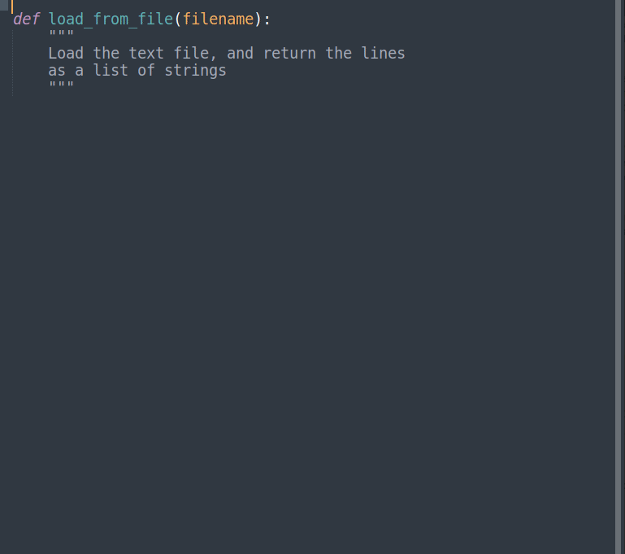

# Codex AI Sublime Package
Work alongside cutting edge AI to write code - automate the boilerplate, and focus on the creative side of coding.

## Disclaimer
This relies entirely upon [OpenAI's API](https://openai.com/blog/openai-api/). You must have an account, and API key, and be authorized to use the [Codex API](https://openai.com/blog/openai-codex/).
You are trusting an outside organization with the code you send them, and it is not encrypted - this cannot be used for HIPPA info, confidential data, etc.
Thanks to OpenAI for their work on this tech - this is not an official package.

Powerful technology can be dangerous. Please use this (and all AI tools) with kindness, care, and the greater good in mind. Supervise all it creates, and, as always, do not run code you do not trust or understand.

## Use
First: input your OpenAI API key in the preferences.
Then, simply highlight whatever code you would like to complete, then use the keybinding 'ctrl+shift+insert' to see how Codex would complete that prompt.

## Tips
Codex is great for filling out bite-sized methods - things like reading a file, creating a server, etc - then you can focus on orchestrating those pieces into a larger project.

Codex can help you determine what libraries you might use to solve a problem. Similarly, if you already know the library you would like, you can suggest Codex use it - (e.g., include 'import numpy').

Including a method name and a clear, standardized comment is a great way to turn 'plain english' into code.
Similarly, you must include some of the conventions / syntax of the language you want codex to generate.(e.g., 'def method_name():' for python vs 'static void methodName() {' for java)

Codex is trained on real users code, and though it can do some extrapolation on it's own, it will likely fail on niche, novel problems. However, for the same, syntax y code you have googled a dozen times, Codex is perfect. ("How do I unpack an .MP4 again? Ah, Codex will know!")
